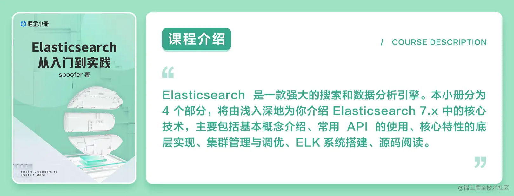

# 掘金 ES 小册学习资料

### 安装 ES

使用 shells 中的脚本进行安装。
其中 InstallClusterEs.sh 是安装伪集群的脚本，而 InstallSingletonEs.sh 单节点的脚本。
如果你的机器无法访问 github，在安装 cerebro 的时候，可以在 https://gitee.com/dgl/es-booklet/raw/master/resources/cerebro-0.9.4.tgz 下载 cerebro 进行手动安装。

### docker 中安装ES

请访问[文档](https://gitee.com/dgl/es-booklet/blob/master/%E5%9C%A8Docker%E4%B8%AD%E5%AE%89%E8%A3%85ES%E3%80%81Kibana%E3%80%81cerebro.md)

### 课程简介
你可以从这里进入[课程](https://juejin.cn/book/7054754754529853475)进行订阅和学习

