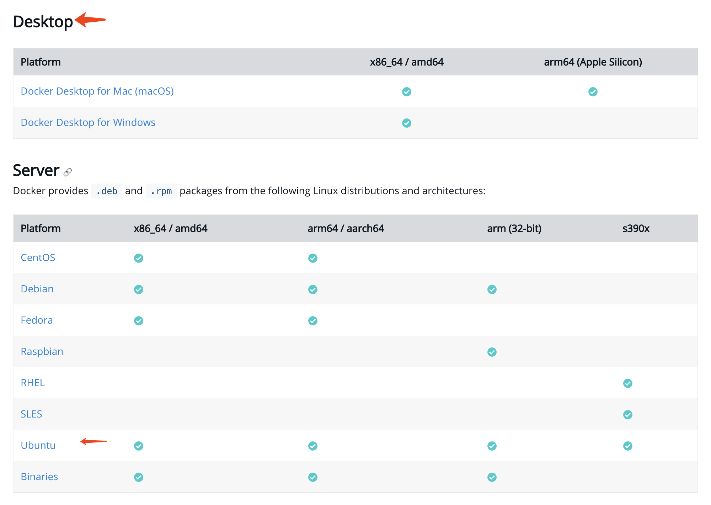
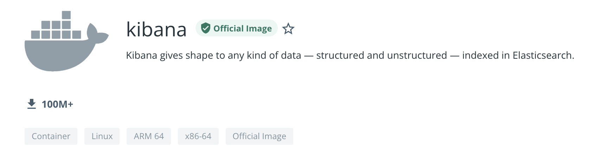
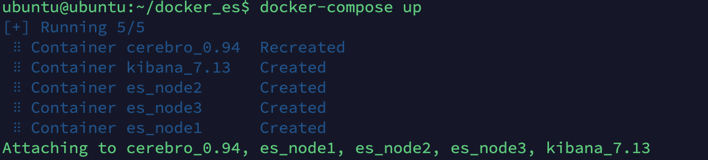
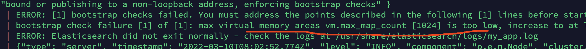

本文介绍如何在 Docker 中安装 Elasticsearch 7.13.0、Kibana 7.13.0、cerebro 0.94。

# 安装docker
在做一切工作之前，我们必须安装 docker。
各个平台的 docker 安装文档请访问[这里](https://docs.docker.com/engine/install/)。如下图，docker 的分为桌面版的和服务版的，因为我使用的是ubuntu，所以点击 server 版下的Ubuntu 跳转到对应的文档即可。



如果你想获取镜像或对应镜像的配置等信息可以访问这个[地址](https://hub.docker.com/)。在搜索栏上搜索 Kiaban 如下：


点击进入后可以看到 Kiaban 这个 Image的信息：


# 安装docker-compose
使用 Docker-compose 可以通过一个配置文件来管理多个Docker 容器，在配置文件中，所有的容器通过 services 来定义，然后使用 docker-compose 脚本来启动，停止和重启应用，和应用中的服务以及所有依赖服务的容器，非常适合组合使用多个容器进行开发的场景。

本次我们将使用 docker-compose 2 来管理我们的容器。点击这里下载 linux 平台的 [docker-compose](https://github.com/docker/compose/releases/download/v2.2.3/docker-compose-linux-x86_64)。如果下载速度很慢的话，我在这里为你做了一个 linux 的[备份](https://gitee.com/dgl/es-booklet/blob/master/resources/docker-compose-linux-x86_64)。更详细的安装文档请参考[官方文档](https://docs.docker.com/compose/install/)，下面是 linux 下的安装方式。

``` bash
# 假设你已经下载文件到本地了

# 重命名
mv docker-compose-linux-x86_64 docker-compose

# 修改权限，使其可以运行
chmod +x docker-compose-linux-x86_64 

# 创建放置文件的目录
sudo mkdir -p /usr/local/lib/docker

# 移动 文件到新创建的目录
sudo mv docker-compose  /usr/local/lib/docker/
 
# 在 ~/.bashrc 文件中加入以下 2行 内容，其作用是加入系统路径，使的系统可以找到 docker-compose 的执行文件

docker_compose_home=/usr/local/lib/docker/
export PATH=$PATH:$docker_compose_home

# 保存 ~/.bashrc 的内容后，需要刷新一下，需要执行以下指令
source ~/.bashrc

# 安装完成后，可以使用以下指令查看 docker-compose 的版本
docker-compose --version
```

# Docker 和 docker-compose 常用指令
### docker命令
``` bash
# 查看哪些容器、线程在运行
docker ps

# 停止或者启动一个容器
docker stop Name/ContainerId
docker start Name/ContainerId
docker restart name/ID

#删除单个容器
docker rm Name/ID
-f, –force=false; 
-l, –link=false Remove the specified link and not the underlying container; 
-v, –volumes=false Remove the volumes associated to the container

#删除所有容器
docker rm `docker ps -a -q`  

# 查看 镜像
docker image ls

# 查看容器日志
docker logs [OPTIONS] CONTAINER 
Options: 
--details 显示更多的信息 
-f, --follow 跟踪实时日志 
--since string 显示自某个timestamp之后的日志，或相对时间，如42m（即42分钟） 
--tail string 从日志末尾显示多少行日志， 默认是all 
-t, --timestamps 显示时间戳 
--until string 显示自某个timestamp之前的日志，或相对时间，如42m（即42分钟）
```

### Docker-compose 命令
```bash
#前台启动
docker-compose up

# 后台启动
docker-compose up -d

#停止容器
docker-compose down

#停止容器并移除数据
docker-compose down -v
```

# 配置 docker 镜像源
如果你拉取镜像的时候网络很慢，可以配置国内的镜像源。
``` bash
# 在 /etc/docker/daemon.json 文件中加入以下内容，如果没有这个文件请手动创建

{
    "registry-mirrors": ["http://f1361db2.m.daocloud.io"] 
}
```
其他源可以参考：
| 网站 | 地址 |
| ---- | ---- |
| 中国官方镜像 | https://registry.docker-cn.com |
| 网易163镜像 | http://hub-mirror.c.163.com |
| 中科大镜像 | https://docker.mirrors.ustc.edu.cn |

# 安装 Elasticsearch、Kibana、cerebro
好了在准备后一切之后，我们可以准备安装 Elasticsearch 7.13.0、Kibana 7.13.0、cerebro 0.94。

点击[这里](https://gitee.com/dgl/es-booklet/blob/master/shells/docker-compose.yaml)下载 docker-compose.yaml。将文件保存为 docker-compose.yaml 后，进入这个文件的目录，执行以下指令即可：

```
docker-compose up
```


如上图是我运行的界面，当然如果你没有下载镜像文件，docker-compose 会自动帮你下载镜像，并且启动容器。

如果 docker-compose 启动失败，说是无权限链接 docker的话，其报错如下：

``` bash
Got permission denied while trying to connect to the Docker daemon socket at unix:///var/run/docker.sock: 

Get "http://%2Fvar%2Frun%2Fdocker.sock/v1.24/containers/json?all=1&filters=%7B%22label%22%3A%7B%22com.docker.compose.project%3Ddocker_es%22%3Atrue%7D%7D&limit=0": 

dial unix /var/run/docker.sock: connect: permission denied
```

可以运行以下指令临时修改：
``` bash
sudo chmod 666 /var/run/docker.sock
```

最后可以访问：
1. cerebro：ip:9000

2. Kibana：ip:5601

3. Elasticsearch: ip:9200，ip:9202，ip:9203

# 我遇到的问题
### 1、Kibana 无法连上 ES，报错如下：

```
kibana_7.13   | {"message":"Unable to retrieve version information from Elasticsearch nodes."}
```
没有更详细的日志，我猜测是我虚拟机的配置太低了，或者我配置的 ES 地址错误。最后升级·硬件配置和在 Kibana 中配置了如下配置才可以：
```
- ELASTICSEARCH_HOSTS=["http://es_node1:9200"]
```

如上例子，其中 es_node1 是容器的名字。

### 2、ES 启动就闪退
也是没有详细的日志，同样猜测虚拟机配置太低，最后把虚拟机硬件配置调整到 4G，4C，然后 ES 的启动内存配为 128m，问题被解决。

### 3、linux 上会触发 es bootstrap checks 而失败

如果你是 linux 上运行这个 docker-compose 文件可能出现如上图的错误，这是因为触发了 bootstrap checks。为什么会触发 bootstrap checks 呢？因为启动时绑定的地址不是回环地址，es 会认为是需要运行在 production 模式。

这个问题可以修改linux的系统设置：

在 /etc/security/limits.conf 加入：

```bash
speng soft nofile 10240
speng hard nofile 10240

* soft nofile 65536
* hard nofile 65536
```

在 /etc/sysctl.conf 加入：

```bash
vm.max_map_count=262144
```

然后执行：
```bash
sudo sysctl -p
```

# 其他学习资料
[创建自己的 ES Docker Image](https://www.elastic.co/cn/blog/how-to-make-a-dockerfile-for-elasticsearch)

[在 docker image 中安装 Elasticsearch 插件](https://www.elastic.co/cn/blog/elasticsearch-docker-plugin-management)

[一个开源的 ELK docker-compose 配置](https://github.com/deviantony/docker-elk)

[docker 中安装 ES 7.13](https://www.elastic.co/guide/en/elasticsearch/reference/7.13/docker.html)

[docker 中安装 Kibana 7.13](https://www.elastic.co/guide/en/kibana/7.13/docker.html)

